# 🛡️ SaucerHedge Backend - Complete Documentation

> **Enterprise-Grade DeFi Hedging Platform with AI-Powered Ability Orchestration**

---

## 📋 Table of Contents

- [🎯 Quick Start](#quick-start)
- [🏗️ Architecture Overview](#architecture-overview)
- [📊 Detailed System Design](#detailed-system-design)
- [🚀 Installation & Setup](#installation--setup)
- [📡 API Documentation](#api-documentation)
- [🔄 Request Flow](#request-flow)
- [🛠️ Services Deep Dive](#services-deep-dive)
- [⚡ Performance Optimization](#performance-optimization)
- [🔐 Security Considerations](#security-considerations)
- [🐛 Troubleshooting](#troubleshooting)
- [🤝 Contributing](#contributing)

***

## 🎯 Quick Start

### Prerequisites
- **Node.js**: 18.0+
- **pnpm**: 8.0+
- **Hedera Account**: Get from [https://portal.hedera.com](https://portal.hedera.com)
- **Gemini API Key**: Get from [https://aistudio.google.com/apikey](https://aistudio.google.com/apikey)
- **Vincent App ID**: Create in [https://heyvincent.ai](https://heyvincent.ai)

### Installation (2 minutes)

```bash
# Clone repository
git clone https://github.com/saucerhedgevault/backend.git
cd backend

# Install dependencies
pnpm install

# Setup environment
cp .env.example .env
# Edit .env with your credentials

# Start development server
pnpm dev

# Verify health
curl http://localhost:3001/api/health
```

***

## 🏗️ Architecture Overview

### High-Level System Design

```mermaid
flowchart TB
    subgraph Frontend["🌐 Frontend (React/Vite)"]
    end
    
    subgraph Server["Express.js HTTP Server (Port 3001)"]
        CORS["CORS Middleware"]
        Error["Error Handling"]
        Logging["Request Logging"]
    end
    
    subgraph Routes["API Routes"]
        ChatRoutes["Chat Routes"]
        AuthRoutes["Auth Routes"]
        HealthRoutes["Health Routes"]
    end
    
    subgraph Agent["HederaAgent (AI Orchestrator)"]
        LLM["Gemini 2.5 Flash LLM"]
        ToolSelect["Tool Selection Logic"]
        ConvMgmt["Conversation Management"]
        RespFormat["Response Formatting"]
    end
    
    subgraph Services["Core Services"]
        AbilityLoader["Ability Loader"]
        TransactionSvc["Transaction Service"]
        VincentSvc["Vincent Service"]
        ResponseFormatter["Response Formatter"]
    end
    
    subgraph Executor["Ability Executor"]
        DynamicExec["Dynamic Ability Execution"]
        ParamBuild["Parameter Building"]
        ResultParse["Result Parsing"]
    end
    
    subgraph External["External Integration"]
        Hedera["Hedera Network<br/>(Testnet & Mainnet)"]
        NPM["NPM Registry<br/>(@saucerhedge)"]
        Abilities["Published Abilities<br/>1. open-position<br/>2. close-position<br/>3. deposit<br/>4. get-status<br/>5. open-vault<br/>6. close-vault"]
    end
    
    subgraph State["State Management"]
        History["Conversation History"]
        Logs["Execution Logs"]
        Cache["Transaction Cache"]
        Sessions["User Sessions"]
    end
    
    Frontend <-->|HTTP/REST| Server
    Server --> Routes
    Routes --> Agent
    Agent --> Services
    Services --> Executor
    Executor --> External
    Agent -.-> State
    
    style Frontend fill:#e1f5ff,stroke:#01579b,stroke-width:2px
    style Agent fill:#fff3e0,stroke:#e65100,stroke-width:2px
    style Executor fill:#f3e5f5,stroke:#4a148c,stroke-width:2px
    style External fill:#e8f5e9,stroke:#1b5e20,stroke-width:2px
    style State fill:#fce4ec,stroke:#880e4f,stroke-width:2px
```



***

## 📊 Detailed System Design

### Multi-Layer Architecture


***

## 🚀 Installation & Setup

### Step 1: Clone & Install

```bash
# Clone the repository
git clone https://github.com/saucerhedgevault/backend.git
cd backend

# Install dependencies with pnpm
pnpm install

# Verify installation
pnpm --version  # Should be 8.0+
node --version  # Should be 18.0+
```

### Step 2: Environment Setup

```bash
# Copy example to .env
cp .env.example .env

# Edit with your credentials
nano .env  # or use your favorite editor
```

**Fill these required fields:**

```env
HEDERA_ACCOUNT_ID=0.0.YOUR_ID           # From Hedera Portal
HEDERA_PRIVATE_KEY=YOUR_DER_KEY         # From Hedera Portal
HEDERA_NETWORK=testnet                  # Start with testnet

GEMINI_API_KEY=YOUR_KEY                 # From Google AI Studio
VINCENT_APP_ID=7142827824               # Your Vincent App ID
VINCENT_REDIRECT_URI=http://localhost:8080/callback
```

### Step 3: Verification

```bash
# Test environment loading
pnpm dev

# In another terminal:
curl http://localhost:3001/api/health

# Expected response:
# {
#   "status": "ok",
#   "timestamp": "2025-10-26T...",
#   "network": "testnet"
# }
```

### Step 4: Load Abilities

```bash
# The backend automatically loads 6 abilities on startup
# Check logs for:
# ✅ Loaded ability: @saucerhedgevault/open-hedged-position-ability
# ✅ Loaded ability: @saucerhedgevault/close-hedged-position-ability
# ... (4 more abilities)
```

***

## 📡 API Documentation

### 1. Chat Endpoint

**POST** `/api/chat`

Send user message and get AI-powered response with ability execution.

#### Request

```bash
curl -X POST http://localhost:3001/api/chat \
  -H "Content-Type: application/json" \
  -d '{
    "message": "Open a hedged position with 100 USDC and 5 HBAR",
    "history": [
      {
        "role": "user",
        "content": "What can you do?"
      },
      {
        "role": "assistant",
        "content": "I can help you hedge LP positions..."
      }
    ]
  }'
```

#### Response (Success)

```json
{
  "id": "1729959234000",
  "role": "assistant",
  "content": "**Opening Hedged LP Position** 🚀\n\n**Position Details:**\n• Position ID: #4523\n• LP Allocation: $79.00\n• Short Allocation: $21.00\n\n**Status:** ✨ **Successfully Opened!**\n📝 TX: [0x789abc](https://hashscan.io/testnet/transaction/0x789abc)",
  "timestamp": "2025-10-26T21:34:00.000Z",
  "txHash": "0x789abc",
  "abilities": ["open-position"],
  "toolUsed": "open-hedged-position"
}
```

#### Response (Error)

```json
{
  "id": "1729959234000",
  "role": "assistant",
  "content": "I encountered an error processing your request: Invalid input parameters. Please try again.",
  "timestamp": "2025-10-26T21:34:00.000Z"
}
```

### 2. Health Check Endpoint

**GET** `/api/health`

Check backend status and network connection.

#### Response

```json
{
  "status": "ok",
  "timestamp": "2025-10-26T21:34:00.000Z",
  "network": "testnet"
}
```

### 3. Auth Endpoints

**POST** `/api/auth/auth-url`

Generate Vincent authentication URL.

#### Request

```bash
curl -X POST http://localhost:3001/api/auth/auth-url \
  -H "Content-Type: application/json" \
  -d '{
    "userAddress": "0x1234..."
  }'
```

#### Response

```json
{
  "authUrl": "https://vincent.hedera.com/auth?app_id=7142827824&...",
  "appId": 7142827824
}
```

***

## 🔄 Request Flow

### Complete Request Processing Pipeline

```mermaid
flowchart TD
    Start["👤 User Types Message"]
    
    subgraph Step1["1️⃣ Frontend POST Request"]
        SendPost["Frontend sends POST /api/chat<br/>Body: {message, history}"]
    end
    
    subgraph Step2["2️⃣ Backend Server Processing"]
        Parse["Parse & Validate Request<br/>✓ Extract message text<br/>✓ Validate JSON format<br/>✓ Check message length"]
    end
    
    subgraph Step3["3️⃣ HederaAgent Processing"]
        Process["HederaAgent.processMessage()<br/>✓ Load conversation history<br/>✓ Build system prompt<br/>✓ Build message array"]
    end
    
    subgraph Step4["4️⃣ LLM Interaction"]
        CallGemini["Call Gemini 2.5 Flash LLM<br/>📡 Send to Google API<br/>⏳ Wait for response (1-3s)<br/>✓ Parse LLM response"]
    end
    
    Decision{"DECISION<br/>Tool Selected?"}
    
    subgraph Step5a["5️⃣a Text Response"]
        TextOnly["Return text response from LLM"]
    end
    
    subgraph Step5b["5️⃣b Tool Execution"]
        ToolExec["Tool Execution<br/>✓ Map tool→ability<br/>✓ Validate inputs<br/>✓ Execute ability<br/>✓ Get results"]
    end
    
    subgraph Step6["6️⃣ Format Response"]
        Format["Format Response<br/>✓ Use template<br/>✓ Inject data<br/>✓ Add tx hash"]
    end
    
    subgraph Step7["7️⃣ Update History"]
        Update["Update Conversation History<br/>✓ Save user message<br/>✓ Save assistant response"]
    end
    
    subgraph Step8["8️⃣ Return Response"]
        Return["Return JSON Response<br/>✓ Set CORS headers<br/>✓ Set Content-Type<br/>✓ Send 200 OK"]
    end
    
    EndUser["📱 Frontend<br/>Display response<br/>Update chat UI<br/>Show transaction link"]
    
    Start --> Step1
    Step1 --> Step2
    Step2 --> Step3
    Step3 --> Step4
    Step4 --> Decision
    Decision -->|No Tool| Step5a
    Decision -->|Tool Selected| Step5b
    Step5a --> Step7
    Step5b --> Step6
    Step6 --> Step7
    Step7 --> Step8
    Step8 --> EndUser
    
    style Start fill:#ff6b6b,stroke:#c92a2a,stroke-width:3px,color:#fff
    style Decision fill:#ffd43b,stroke:#f59f00,stroke-width:3px
    style Step1 fill:#e3f2fd,stroke:#1976d2,stroke-width:2px
    style Step2 fill:#f3e5f5,stroke:#7b1fa2,stroke-width:2px
    style Step3 fill:#fff3e0,stroke:#f57c00,stroke-width:2px
    style Step4 fill:#e8f5e9,stroke:#388e3c,stroke-width:2px
    style Step5a fill:#fce4ec,stroke:#c2185b,stroke-width:2px
    style Step5b fill:#e0f2f1,stroke:#00796b,stroke-width:2px
    style Step6 fill:#fff9c4,stroke:#f57f17,stroke-width:2px
    style Step7 fill:#ede7f6,stroke:#512da8,stroke-width:2px
    style Step8 fill:#e1f5fe,stroke:#01579b,stroke-width:2px
    style EndUser fill:#c8e6c9,stroke:#2e7d32,stroke-width:3px
```



***

## 🛠️ Services Deep Dive

### HederaAgent Service

**Purpose**: Main AI orchestration engine using Gemini 2.5 Flash

**Key Methods**:
- `processMessage()` - Main entry point for processing user messages
- `getConversationHistory()` - Retrieve conversation for user
- `updateConversationHistory()` - Save messages
- `getExecutionLogs()` - View execution history
- `getStats()` - Get agent statistics

**Features**:
- ✅ Multi-user support with per-user conversation history
- ✅ Tool calling with dynamic ability selection
- ✅ Execution logging for debugging
- ✅ Memory management (keeps last 50 messages)
- ✅ Error recovery with graceful fallbacks

### AbilityExecutor Service

**Purpose**: Execute Vincent abilities on Hedera network

**Key Methods**:
- `executeAbility()` - Execute any ability with inputs
- `getExecutionHistory()` - View past executions
- `executeAbilityContract()` - Low-level contract execution

**Features**:
- ✅ Dynamic ability loading from NPM
- ✅ Parameter validation
- ✅ Transaction monitoring
- ✅ Result parsing
- ✅ Error handling

### TransactionService

**Purpose**: Hedera blockchain interaction

**Key Methods**:
- `executeContractFunction()` - Call smart contracts
- `getTransactionStatus()` - Check transaction status
- `waitForConfirmation()` - Monitor for completion
- `estimateGas()` - Predict gas usage
- `getHashScanUrl()` - Generate explorer links

**Features**:
- ✅ Parameter building for all ability types
- ✅ Gas estimation
- ✅ Transaction monitoring with retry logic
- ✅ History tracking
- ✅ Explorer URL generation

### ResponseFormatter Service

**Purpose**: Format AI agent responses dynamically

**Key Methods**:
- `formatAbilityResponse()` - Format ability results

**Features**:
- ✅ Ability-specific templates
- ✅ Markdown formatting
- ✅ Dynamic data injection
- ✅ Table formatting
- ✅ Transaction link generation

***

## ⚡ Performance Optimization

### Caching Strategy

| Cache Type | TTL | Miss Rate | Memory Impact |
|------------|-----|-----------|---------------|
| Ability Metadata | 3600s | ~5% | Minimal |
| Conversation History | Session | N/A | ~50KB/user |
| Execution Logs | Session | N/A | ~2MB max |

### Response Times (Benchmarks)

| Operation | Time | Notes |
|-----------|------|-------|
| Health Check | 5ms | Direct response |
| Text Response (no tool) | 1-3s | LLM latency |
| Tool Execution | 2-5s | Hedera network |
| Total Chat Response | 3-8s | Combined |

***

## 🔐 Security Considerations

### Environment Variable Protection

```bash
❌ DON'T COMMIT:
- .env files
- Private keys
- API keys
- Account credentials

✅ DO COMMIT:
- .env.example
- Configuration schemas
- Documentation
```

### JWT Tokens (Optional)

```typescript
// For production, implement JWT validation:
const validateToken = (token: string) => {
  try {
    jwt.verify(token, process.env.JWT_SECRET);
    return true;
  } catch {
    return false;
  }
};
```

### Rate Limiting

```typescript
// Recommended rate limits:
- 100 requests per minute per IP
- 10 concurrent connections per user
- 5MB max request body size
```

***

## 🐛 Troubleshooting

### Common Issues

#### 1. "HEDERA_ACCOUNT_ID not found"

```bash
# Solution: Set environment variable
export HEDERA_ACCOUNT_ID=0.0.YOUR_ID
# Or add to .env file
```

#### 2. "Failed to load ability"

```bash
# Check npm registry connection
npm ping

# Clear ability cache
# Delete node_modules/.cache directory

# Verify network
curl -I https://registry.npmjs.org
```

#### 3. "Gemini API error"

```bash
# Verify API key
echo $GEMINI_API_KEY

# Check quota
# Visit: https://console.cloud.google.com

# Test API connectivity
curl -X POST https://generativelanguage.googleapis.com/v1beta/openai/chat/completions
```

#### 4. "Transaction timeout"

```bash
# Increase timeout in .env
TRANSACTION_TIMEOUT=60000  # 60 seconds

# Check Hedera network status
curl https://status.hedera.com
```

### Debug Mode

```bash
# Enable debug logging
LOG_LEVEL=debug pnpm dev

# Watch specific service
NODE_DEBUG=hedera,abilities pnpm dev
```

***

## 🤝 Contributing

### Adding New Abilities

1. **Create ability package**
   ```bash
   mkdir packages/my-ability
   cd packages/my-ability
   pnpm init
   ```

2. **Add to AbilityLoader**
   ```typescript
   const abilities = [
     // ... existing
     '@saucerhedgevault/my-ability',
   ];
   ```

3. **Add to ResponseFormatter**
   ```typescript
   'my-ability': (data, ctx) => `
     **My Ability Response** 🚀
     ${ctx}
     ...
   `
   ```

### Testing

```bash
# Run tests
pnpm test

# Test specific service
pnpm test -- hederaAgent

# Watch mode
pnpm test --watch
```

***

## 📚 Additional Resources

- **Hedera Docs**: [https://docs.hedera.com](https://docs.hedera.com)
- **Gemini API**: [https://ai.google.dev](https://ai.google.dev)
- **Vincent Protocol**: [https://docs.heyvincent.ai](https://docs.heyvincent.ai)
- **Express.js**: [https://expressjs.com](https://expressjs.com)
- **TypeScript**: [https://www.typescriptlang.org](https://www.typescriptlang.org)

***

## 📞 Support

- 🐛 **Issues**: Open on GitHub
- 💬 **Discussions**: GitHub Discussions
- 📧 **Email**: support@saucerhedge.com
- 🔗 **Discord**: https://discord.gg/saucerhedge

***

**Built with ❤️ by SaucerHedge Team**

*Last Updated: October 26, 2025*
